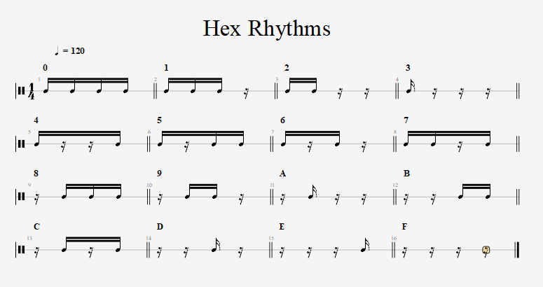

# hex-rhythm
A hexadecimal based rhythm generator

## Concept
Inspired by a [YouTube video](https://www.youtube.com/watch?v=6tNxfx2tetA) from [Signals Music Studio](https://www.youtube.com/channel/UCRDDHLvQb8HjE2r7_ZuNtWA) in which [Pi](https://en.wikipedia.org/wiki/Pi) is converted to [hexadecimal](https://en.wikipedia.org/wiki/Hexadecimal) and translated into a rhythm by mapping each hexadecimal bit value to one of the 16 combinations of 1 [quarter note](https://en.wikipedia.org/wiki/Quarter_note)'s worth of [sixteenth notes](https://en.wikipedia.org/wiki/Sixteenth_note).

### Combinations
The combinations and their mapping to hexidecimal bit values are as follows (roughly made on [Guitar Pro 7](https://www.guitar-pro.com/)):

## Code

## Test
